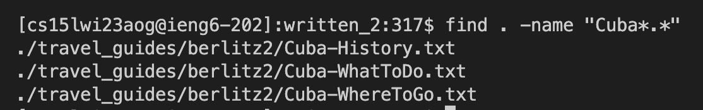
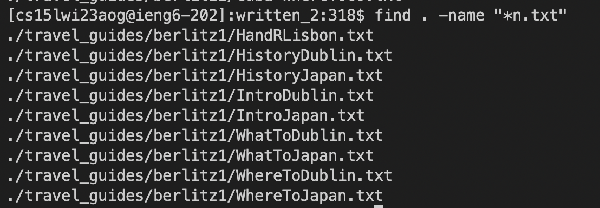

# Lab Report 3 - Terminal Command Lines (Week 5)
## "find -name" Usage
For this lab report, I chose to use the "find" command to demonstrate the variety of ways that it can be utilized to navigate your directories and files.

The first variation of "find" is the "-name", which finds the file or directory that has the matching string of characters.

```
[cs15lwi23aog@ieng6-202]:written_2:317$ find . -name "Cuba*.*"
./travel_guides/berlitz2/Cuba-History.txt
./travel_guides/berlitz2/Cuba-WhatToDo.txt
./travel_guides/berlitz2/Cuba-WhereToGo.txt
```



Here I used the "find -name" command to find all files that contained the pretext "Cuba", using * to account for different aftertext or types of file.



Here I modified the command to find all .txt files that ended with a lowercase "n".
