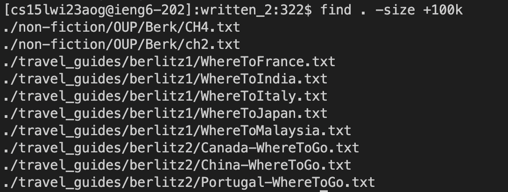
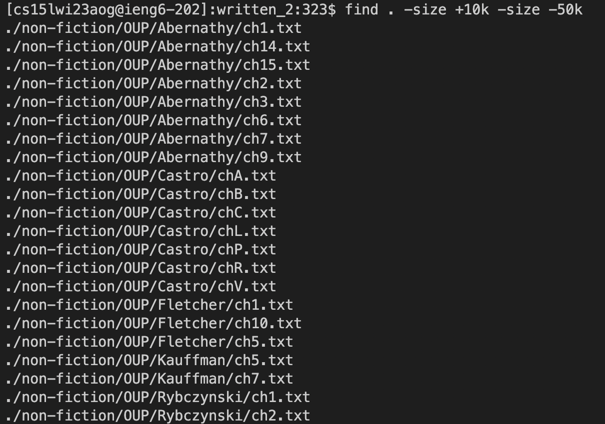

# Lab Report 3 - Terminal Command Lines (Week 5)
For this lab report, I chose to use the "find" command to demonstrate the variety of ways that it can be utilized to navigate your directories and files.

## "find -name" Usage
The first variation of "find" is "-name", which finds the file or directory that has the matching string of characters. I found the options for this commands through asking ChatGPT, and it gave out several options.

```
[cs15lwi23aog@ieng6-202]:written_2:317$ find . -name "Cuba*.*"
./travel_guides/berlitz2/Cuba-History.txt
./travel_guides/berlitz2/Cuba-WhatToDo.txt
./travel_guides/berlitz2/Cuba-WhereToGo.txt
```


Here I used the "find -name" command to find all files that contained the pretext "Cuba", using * to account for different aftertext or types of file. This can help you find specific files that have certain strings.

```
[cs15lwi23aog@ieng6-202]:written_2:318$ find . -name "*n.txt"
./travel_guides/berlitz1/HandRLisbon.txt
./travel_guides/berlitz1/HistoryDublin.txt
./travel_guides/berlitz1/HistoryJapan.txt
./travel_guides/berlitz1/IntroDublin.txt
./travel_guides/berlitz1/IntroJapan.txt
./travel_guides/berlitz1/WhatToDublin.txt
./travel_guides/berlitz1/WhatToJapan.txt
./travel_guides/berlitz1/WhereToDublin.txt
./travel_guides/berlitz1/WhereToJapan.txt
```


Here I modified the command to find all .txt files that ended with a lowercase "n". This can help you find specific file types that ended with certains strings.

## "find -size" Usage
The second variation of "find" is "-size", which finds files of specific sizes. I found this option from search on Google and on this website https://www.tecmint.com/35-practical-examples-of-linux-find-command/

```
[cs15lwi23aog@ieng6-202]:written_2:322$ find . -size +100k
./non-fiction/OUP/Berk/CH4.txt
./non-fiction/OUP/Berk/ch2.txt
./travel_guides/berlitz1/WhereToFrance.txt
./travel_guides/berlitz1/WhereToIndia.txt
./travel_guides/berlitz1/WhereToItaly.txt
./travel_guides/berlitz1/WhereToJapan.txt
./travel_guides/berlitz1/WhereToMalaysia.txt
./travel_guides/berlitz2/Canada-WhereToGo.txt
./travel_guides/berlitz2/China-WhereToGo.txt
./travel_guides/berlitz2/Portugal-WhereToGo.txt
```



Here I used the command to find all files that was above 100 Kilobytes in size. This can help you find larger files that would be more important.

```
[cs15lwi23aog@ieng6-202]:written_2:323$ find . -size +10k -size -50k
./non-fiction/OUP/Abernathy/ch1.txt
./non-fiction/OUP/Abernathy/ch14.txt
./non-fiction/OUP/Abernathy/ch15.txt
./non-fiction/OUP/Abernathy/ch2.txt
./non-fiction/OUP/Abernathy/ch3.txt
./non-fiction/OUP/Abernathy/ch6.txt
./non-fiction/OUP/Abernathy/ch7.txt
./non-fiction/OUP/Abernathy/ch9.txt
./non-fiction/OUP/Castro/chA.txt
./non-fiction/OUP/Castro/chB.txt
./non-fiction/OUP/Castro/chC.txt
./non-fiction/OUP/Castro/chL.txt
./non-fiction/OUP/Castro/chP.txt
./non-fiction/OUP/Castro/chR.txt
./non-fiction/OUP/Castro/chV.txt
./non-fiction/OUP/Fletcher/ch1.txt
./non-fiction/OUP/Fletcher/ch10.txt
./non-fiction/OUP/Fletcher/ch5.txt
./non-fiction/OUP/Kauffman/ch5.txt
./non-fiction/OUP/Kauffman/ch7.txt
./non-fiction/OUP/Rybczynski/ch1.txt
./non-fiction/OUP/Rybczynski/ch2.txt
```




